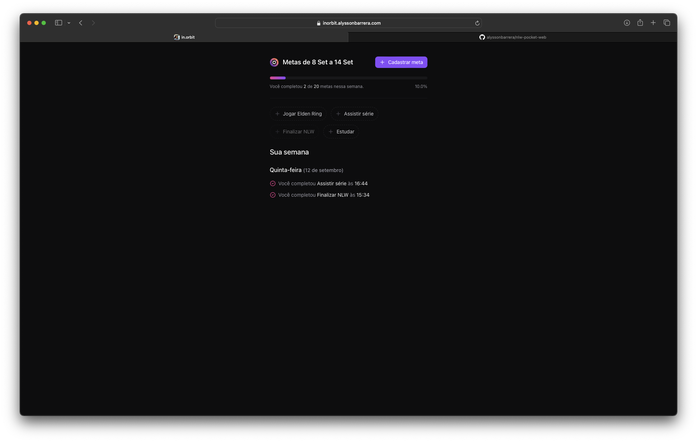
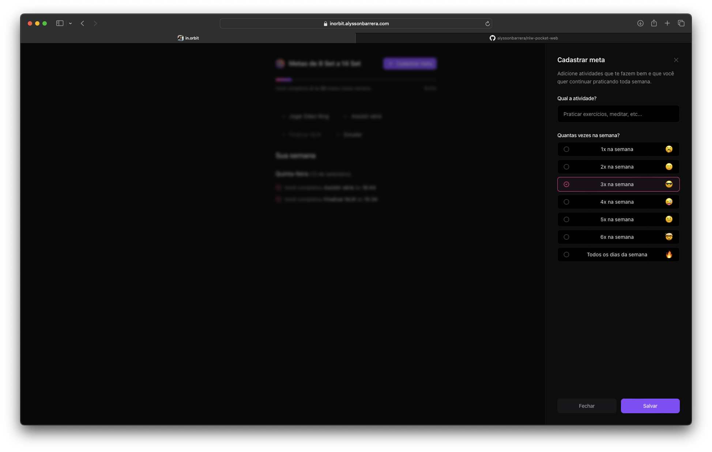

# Goal Tracking - NLW Pocket | Rocketseat

## Português

#### Página Web de Acompanhamento de Metas

A aplicação foi desenvolvida em React, utilizando TypeScript, TailwindCSS e outras bibliotecas. Ela consome uma API REST que permite visualizar, cadastrar e concluir metas.

## English

#### Goal Tracking Web Page

The application was developed in React, using TypeScript, TailwindCSS and other libraries. It consumes a REST API that allows users to view, create, and complete goals.

## Screenshots

    

        
        
    

## Video

https://github.com/user-attachments/assets/550076c0-32d2-4ac8-9d3e-daff8e380ea9

## Stack

  
